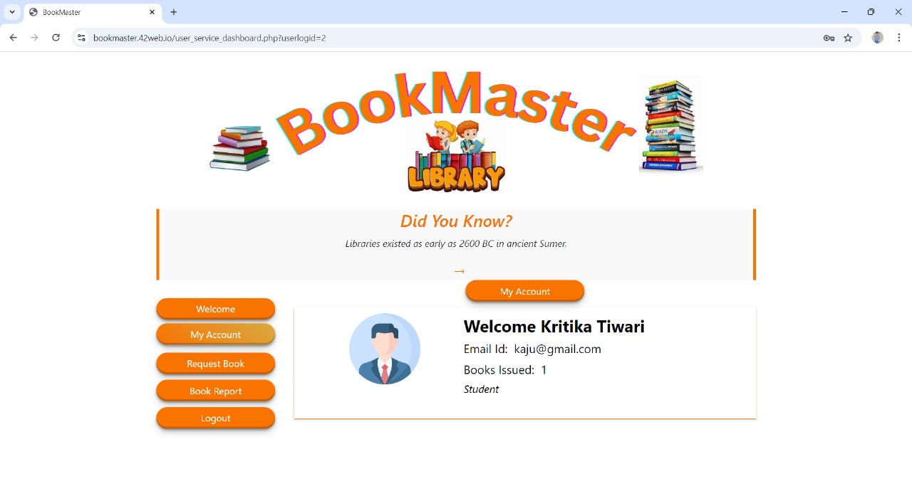

# BookMaster

## Overview

BookMaster is a robust web-based Library Management System designed to efficiently manage library resources and operations. It caters to both librarians and library users, providing a seamless experience for managing books, user accounts, and transaction records.

## Technologies Used
- **Frontend:** HTML, CSS, JavaScript
- **Backend:** PHP
- **Database:** MySQL
- **Deployment:** InfinityFree

## Features

### User Panel
The user panel provides essential functionalities for both students and teachers to interact with the library system.

Key features of the user panel include:

- **User Registration & Login:** Users can create accounts and securely log in.
- **Account Overview:** Users can access their account details and track issued books.
- **Book Search & Request:** Users can search for books and request them if available.
- **View Issued Books:** Users can view the details of books they have issued.

### Admin Panel
The admin panel is designed for library staff to efficiently manage the library's operations.

Key features of the admin panel include:

- **Add, Update, & Delete Books:** Admins can manage the book inventory.
- **Manage Users:** Admins can view, delete, or modify user accounts.
- **View Issued Books & Requests:** Admins can track issued books and manage user requests.
- **Generate Reports:** Admins can generate reports on user activity and book statistics.

